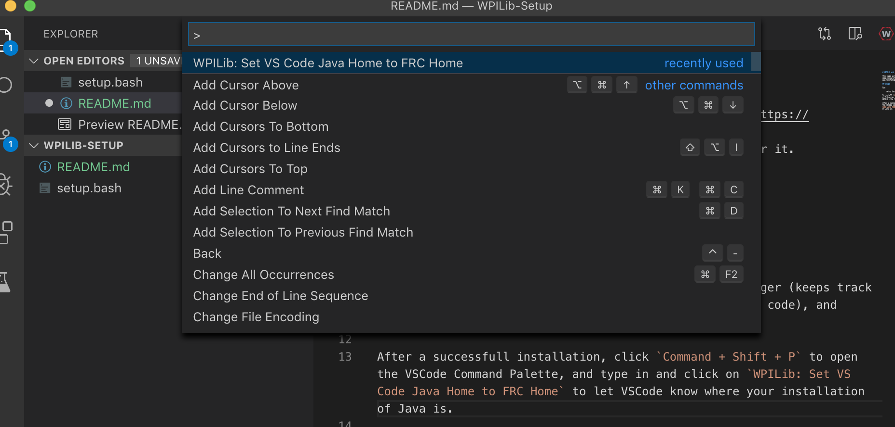

# WPILib and VSCode Setup

This repo will help you download [Visual Studio Code](https://code.visualstudio.com/) and setup [WPILib](https://www.firstinspires.org/robotics/frc/blog/2019-wpilib) for it. 

## Usage

Run 

    setup.bash

To install [homebrew](https://brew.sh/), a package manager (keeps track of libraries for you), VSCode (a place for you to write code), and WPILib (the library used for writing robot code).

After a successfull installation, click `Command + Shift + P` to open the VSCode Command Palette, and type in and click on `WPILib: Set VS Code Java Home to FRC Home` to let VSCode know where your installation of Java is.

